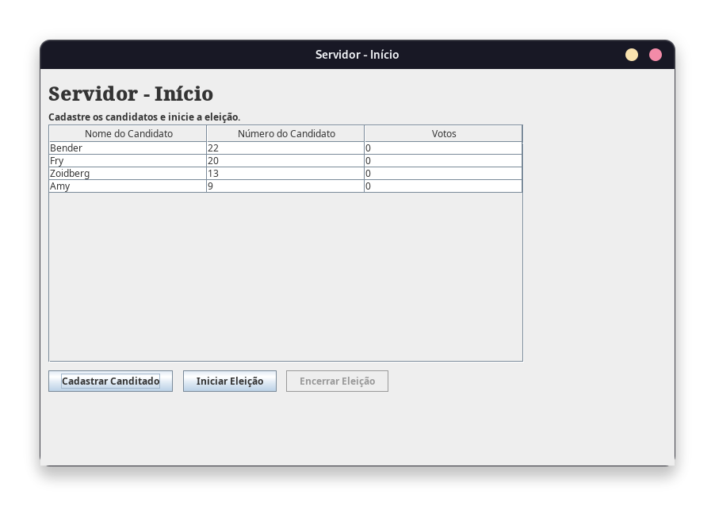
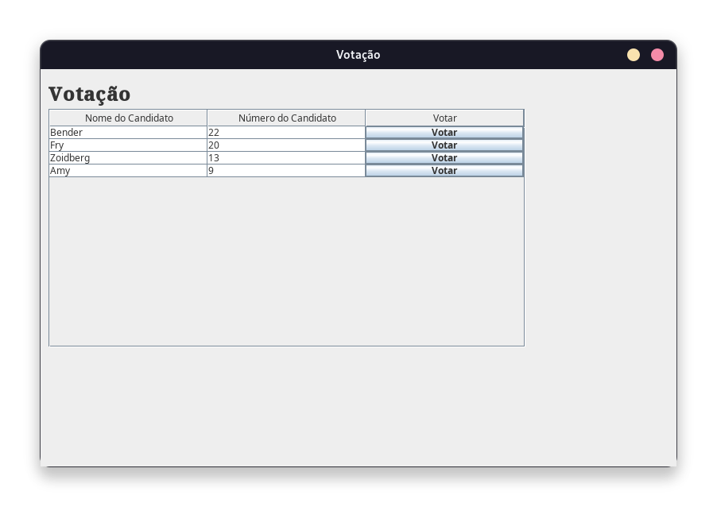
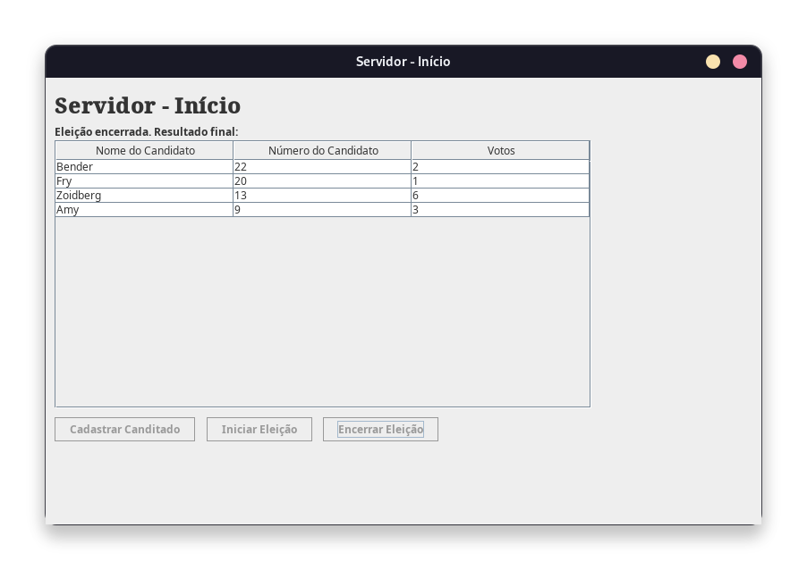

# Sistema de Eleição em Java usando RMI

O código contém um servidor e um cliente que se comunicam através de RMI. O 
servidor é responsável por armazenar os candidatos e os votos, enquanto o
cliente é responsável por enviar votos e receber informações sobre os candidatos.

O projeto foi feito para matéria de Sistemas Distribuídos.

## Executando o projeto

É requerido que o Java 21 e o Maven esteja instalado na máquina.

Para construir os `.jar`, use o seguinte comando:

`mvn clean install`

Isso irá gerar os `.jar` na pasta `target/`. O `jar` do servidor se encontrará
em `target/votacao-1.0-SNAPSHOT-server.jar` e do cliente em `target/votacao-1.0-SNAPSHOT-client.jar`.

### Servidor

Para iniciar o servidor, execute:

`java -jar target/votacao-1.0-SNAPSHOT-server.jar`

Com isso, a tela do Java Swing irá abrir. É necessário cadastrar os candidatos
e iniciar a eleição (através do botão na interface) antes de iniciar o cliente.

### Cliente

Para iniciar o cliente, execute:

`java -jar target/votocao-1.0-SNAPSHOT-client.jar`

> [!IMPORTANT]  
> O cliente só pode ser iniciado após o servidor ter iniciado a eleição.

Com isso, a tela do Java Swing irá abrir. Por lá, será possível votar nos 
candidatos.

## Uso

É necessário iniciar primeiro o servidor. Por lá, serão cadastrados os candidatos.
Após todos os canditados serem cadastrados, é necessário "Iniciar Eleição", por meio
do botão na interface.

Somente após iniciar a eleição, os clientes poderão ser iniciados. Eles 
irão buscar a lista de candidatos do servidor e permitirão votar nos mesmos.

O servidor atualiza a cada 5 segundos a quantidade de votos de cada candidato.

Ao final do período de votação, é possível encerrar a eleição por meio da interface
do servidor. Após encerrar a eleição, os clientes não poderão mais votar.

E o servidor mostrará o resultado final da eleição.

## Licença

This project is licensed under [GNU AFFERO GENERAL PUBLIC LICENSE](./LICENSE).

This program is free software; you can redistribute it and/or modify
it under the terms of the [GNU Affero General Public License](./LICENSE).

The GNU Affero General Public License is a modified version of the ordinary 
GNU GPL version 3. It has one added requirement: if you run a modified 
program on a server and let other users communicate with it there,
your server must also allow them to download the source code corresponding 
to the modified version running there.

This program is distributed in the hope that it will be useful,
but WITHOUT ANY WARRANTY; without even the implied warranty of
MERCHANTABILITY or FITNESS FOR A PARTICULAR PURPOSE. See the
[GNU Affero General Public License](./LICENSE) for more details.

